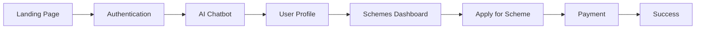

# 🚀 BEACON - AI Government Schemes Platform

<div align="center">


**Empowering Citizens Through AI-Powered Scheme Discovery**

[](https://reactjs.org/)
[](https://www.typescriptlang.org/)
[](https://tailwindcss.com/)
[](https://supabase.com/)

</div>

## 📋 Problem Statement

In India, millions of citizens remain unaware of government schemes, scholarships, and programs that could benefit them. The current process involves:
- Complex paperwork and documentation
- Long queues at MEE SEVA centers
- Lack of awareness about available schemes
- Difficulty understanding eligibility criteria
- Manual application processes

## 💡 Solution

**BEACON** is an AI-powered automation platform that revolutionizes how citizens discover and access government schemes. Our platform:

✨ **Discovers** schemes through intelligent AI conversations  
🤖 **Automates** eligibility checking based on user profiles  
📝 **Simplifies** application processes with one-click submissions  
💳 **Streamlines** payments through integrated UPI  
📊 **Tracks** application status in real-time  

## 🎯 Key Features

### 🔐 Smart Authentication
- Phone number-based login
- Secure OTP verification
- Seamless user experience

### 🤖 AI-Powered Chatbot
- Conversational data collection
- Intelligent question flow
- Real-time eligibility assessment
- Natural language understanding

### 📊 Schemes Dashboard
- 8+ Government schemes integrated
- Automatic eligibility indicators
- One-click application
- Status tracking

### 👤 User Profile Management
- Comprehensive profile creation
- Document upload support
- Edit and update capabilities

### 💰 Integrated Payments
- UPI payment processing
- Secure transaction handling
- Instant confirmations

## 🛠️ Tech Stack

### Frontend
- **React** with TypeScript
- **Tailwind CSS 4.0** for styling
- **Framer Motion** for animations
- **shadcn/ui** component library
- **Lucide React** for icons

### Backend
- **Supabase** for database and auth
- **Hono** web framework for Edge Functions
- **KV Store** for data persistence

### Design
- Glassmorphic UI theme
- Gradient accents
- Smooth animations
- Mobile-responsive layout

## 🚀 Quick Start

### Prerequisites
```bash
Node.js 18+
npm or yarn
Supabase account
```

### Installation

1. **Clone the repository**
```bash
git clone https://github.com/yourusername/beacon.git
cd beacon
```

2. **Install dependencies**
```bash
npm install
```

3. **Set up environment variables**
Create a `.env` file:
```env
VITE_SUPABASE_URL=your_supabase_url
VITE_SUPABASE_ANON_KEY=your_anon_key
VITE_SUPABASE_SERVICE_ROLE_KEY=your_service_role_key
```

4. **Run the development server**
```bash
npm run dev
```

5. **Open your browser**
```
http://localhost:5173
```

## 📱 Application Flow



1. **Landing** - Introduction to BEACON
2. **Auth** - Phone + OTP verification
3. **AI Chat** - Conversational data collection
4. **Profile** - Review and edit information
5. **Schemes** - Browse eligible schemes
6. **Apply** - One-click application
7. **Payment** - UPI payment processing
8. **Status** - Track application

## 🎨 Design Philosophy

BEACON features a modern **glassmorphic** design with:
- Semi-transparent backgrounds
- Backdrop blur effects
- Gradient borders and accents
- Smooth transitions and animations
- Purple/blue color scheme
- High-end visual polish

## 📂 Project Structure

```
beacon/
├── App.tsx                      # Main application entry
├── components/
│   ├── AuthSystem.tsx          # Authentication flow
│   ├── ChatbotInterface.tsx    # AI chatbot
│   ├── Dashboard.tsx           # Main dashboard
│   ├── LandingPage.tsx         # Hero section
│   ├── PaymentInterface.tsx    # Payment processing
│   ├── SchemesDashboard.tsx    # Schemes listing
│   ├── UserProfile.tsx         # Profile management
│   └── ui/                     # shadcn components
├── styles/
│   └── globals.css             # Global styles
├── supabase/
│   └── functions/server/       # Backend API
└── utils/
    └── supabase/               # Supabase config
```

## 🔧 Configuration

### Supabase Setup
1. Create a new Supabase project
2. Copy your project URL and anon key
3. Add to environment variables
4. Deploy edge functions

### Mock Integrations
Currently using mock implementations for:
- Gemini AI chatbot (predefined questions)
- OTP verification (simulated)
- Document uploads (UI only)
- UPI payments (mock gateway)

## 🎯 Roadmap

- [ ] Real Gemini AI integration
- [ ] Live SMS OTP via Twilio
- [ ] Document storage in Supabase Storage
- [ ] Real payment gateway (Razorpay/Stripe)
- [ ] Multi-language support (Hindi, Telugu, Tamil, etc.)
- [ ] Advanced filtering and search
- [ ] Admin dashboard
- [ ] Mobile app (React Native)

## 🤝 Contributing

Contributions are welcome! Please feel free to submit a Pull Request.

1. Fork the project
2. Create your feature branch (`git checkout -b feature/AmazingFeature`)
3. Commit your changes (`git commit -m 'Add some AmazingFeature'`)
4. Push to the branch (`git push origin feature/AmazingFeature`)
5. Open a Pull Request

## 📄 License

This project is licensed under the MIT License - see the [LICENSE](LICENSE) file for details.

## 👨‍💻 Author

Built with ❤️ for [Your Hackathon Name]

**Your Name**  
- GitHub: [@yourusername](https://github.com/yourusername)
- LinkedIn: [Your LinkedIn](https://linkedin.com/in/yourprofile)
- Email: your.email@example.com

## 🙏 Acknowledgments

- Thanks to all government schemes that inspired this project
- shadcn/ui for the beautiful component library
- Supabase for the amazing backend platform
- The open-source community

## 📸 Screenshots

### Landing Page


### AI Chatbot


### Schemes Dashboard


---

<div align="center">

**Made with 💜 for India's Digital Future**

⭐ Star this repo if you find it helpful!

</div>
